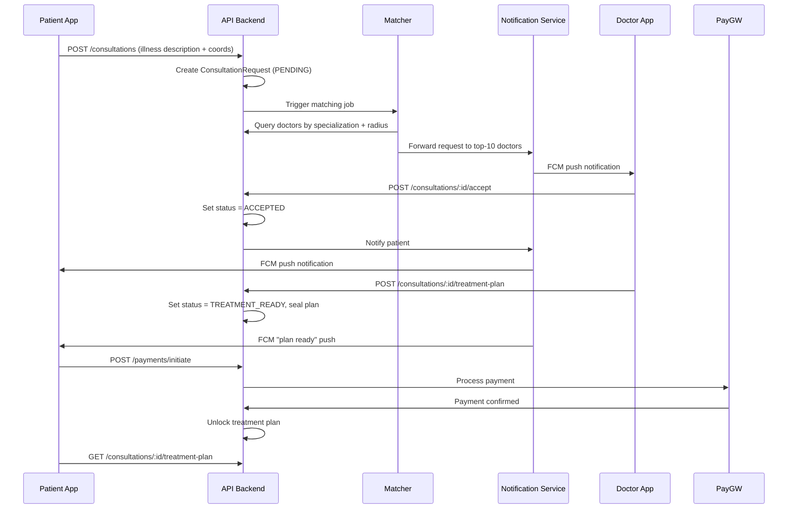
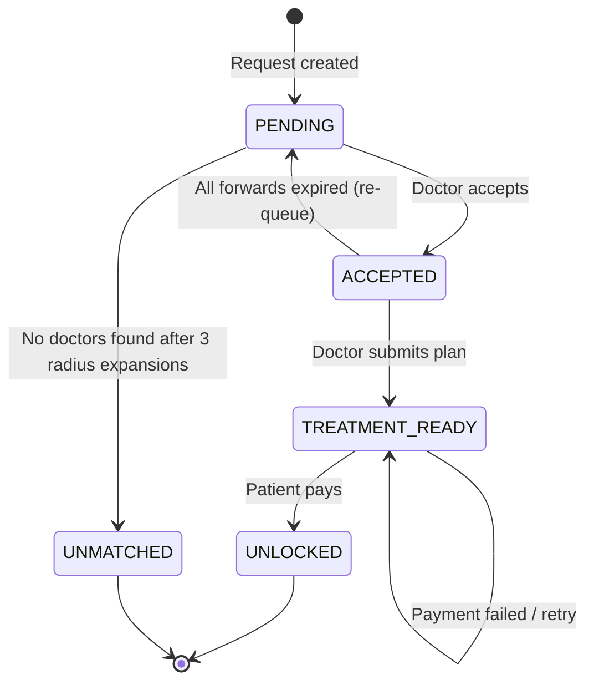
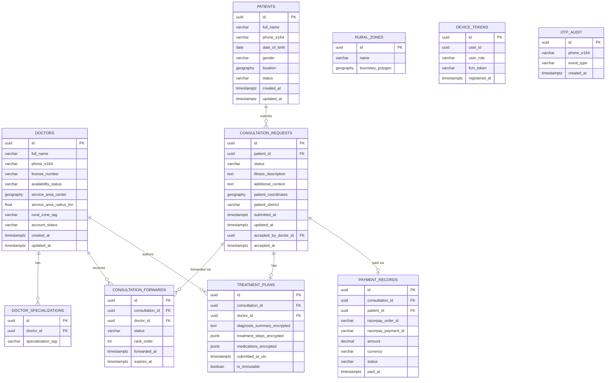

# Design Document: RuralHealthConnect

## Overview

RuralHealthConnect is an asynchronous teleconsultation mobile application that bridges the healthcare gap in rural and remote areas. The system follows a request-response consultation model: a patient submits a text-based illness description, the system matches and forwards the request to nearby specialist doctors, a doctor accepts and submits a treatment plan, and the patient pays a fee to unlock the advice.

The design prioritizes:
- **Low-bandwidth resilience**: rural users may have intermittent connectivity; asynchronous flows and push notifications are used over persistent connections.
- **Geographic awareness**: geospatial querying with PostGIS enables sub-500ms doctor discovery across up to 100,000 profiles.
- **Privacy by design**: patient PII is isolated at the data layer; doctors never see precise coordinates or personal identifiers.
- **Immutability of medical records**: treatment plans are sealed on submission and encrypted at rest.

### Key Design Decisions

1. **Flutter for the mobile client** — single codebase for Android and iOS, well-suited for rural healthcare apps that need to run on mid-range Android devices.
2. **Node.js (TypeScript) + Express for the API layer** — straightforward HTTP API with clear separation of domain services; easy to deploy on VMs or containers.
3. **PostgreSQL + PostGIS for the database** — native geospatial extension allows radius queries with GIST index, meeting the 500ms SLA for 100k doctor profiles without a separate geo service.
4. **Firebase Cloud Messaging (FCM) for push notifications** — handles delivery to offline devices with built-in retry, critical for rural users with intermittent connectivity.
5. **Redis for OTP and ephemeral state** — short TTL keys for OTP codes and consultation forwarding queues.
6. **Razorpay (UPI + mobile money)** as the primary payment gateway — UPI is the most preferred payment mode in rural India (38% share per EY/CII 2024 report); Razorpay supports UPI, mobile money, and prepaid instruments in a single SDK.

---

## Architecture

The system is structured as a three-tier mobile application: a Flutter mobile client, a RESTful API backend, and a PostgreSQL/PostGIS persistence layer with supporting services.

```mermaid
graph TB
    subgraph Mobile Client [Flutter Mobile App]
        PatientApp[Patient Screens]
        DoctorApp[Doctor Screens]
    end

    subgraph API Backend [Node.js / Express API]
        AuthService[Auth Service\nOTP · JWT]
        PatientService[Patient Service]
        DoctorService[Doctor Service]
        ConsultationService[Consultation Service]
        MatcherService[Matcher Service]
        TreatmentService[Treatment Plan Service]
        PaywallService[Paywall Service]
        NotificationService[Notification Service]
    end

    subgraph Data Layer
        Postgres[(PostgreSQL\n+ PostGIS)]
        Redis[(Redis\nOTP · Queues)]
    end

    subgraph External Services
        FCM[Firebase Cloud\nMessaging]
        SMS[SMS Gateway\nTwilio / MSG91]
        PayGW[Payment Gateway\nRazorpay]
    end

    Mobile Client <-->|HTTPS / TLS 1.2+| API Backend
    API Backend --> Postgres
    API Backend --> Redis
    NotificationService --> FCM
    AuthService --> SMS
    PaywallService --> PayGW
    FCM -->|Push| Mobile Client
```

### Request Lifecycle



---

## Components and Interfaces

### 1. Auth Service

Handles patient and doctor registration, OTP lifecycle, and JWT issuance.

**Endpoints:**
| Method | Path | Description |
|--------|------|-------------|
| `POST` | `/auth/register/patient` | Start patient registration; sends OTP |
| `POST` | `/auth/verify-otp` | Verify OTP; creates account and returns JWT |
| `POST` | `/auth/resend-otp` | Resend OTP (rate-limited) |
| `POST` | `/auth/register/doctor` | Doctor registration; validates license |
| `POST` | `/auth/login` | Login with phone + OTP |
| `POST` | `/auth/refresh` | Refresh JWT |

**OTP Flow:**
- A 6-digit numeric OTP is generated using a cryptographically secure RNG.
- The OTP is stored in Redis as `otp:{phone_e164}` with a 10-minute TTL and an attempt counter (`otp_attempts:{phone_e164}`, max 3).
- After 3 failed attempts, the key is invalidated and must be re-requested.
- SMS delivery is via Twilio or MSG91 (MSG91 preferred for India due to DLT compliance).

**JWT Structure:**
```json
{
  "sub": "<user_uuid>",
  "role": "PATIENT | DOCTOR",
  "iat": 1700000000,
  "exp": 1700086400
}
```

---

### 2. Patient Service

Manages patient profile CRUD and consultation history retrieval.

**Endpoints:**
| Method | Path | Description |
|--------|------|-------------|
| `GET` | `/patients/me` | Get own profile |
| `PUT` | `/patients/me` | Update profile |
| `DELETE` | `/patients/me` | Delete account (triggers PII anonymization) |
| `GET` | `/patients/me/consultations` | List consultation history (paginated, reverse-chron) |

---

### 3. Doctor Service

Manages doctor profiles, availability updates, and the doctor consultation queue.

**Endpoints:**
| Method | Path | Description |
|--------|------|-------------|
| `GET` | `/doctors/me` | Get own profile |
| `PUT` | `/doctors/me` | Update profile / specializations |
| `PUT` | `/doctors/me/availability` | Update availability status |
| `GET` | `/doctors/me/queue` | Get consultation queue segmented by status |

---

### 4. Consultation Service

Core domain service for the consultation lifecycle.

**Endpoints:**
| Method | Path | Description |
|--------|------|-------------|
| `POST` | `/consultations` | Create consultation request |
| `GET` | `/consultations/:id` | Get consultation detail (role-aware view) |
| `POST` | `/consultations/:id/accept` | Doctor accepts request |
| `GET` | `/consultations/:id/treatment-plan` | View treatment plan (gated by Paywall) |
| `POST` | `/consultations/:id/treatment-plan` | Doctor submits treatment plan |

**Status State Machine:**


---

### 5. Matcher Service

Background job triggered on consultation creation. Runs synchronously as a worker triggered via an internal job queue (Bull/BullMQ on Redis).

**Algorithm:**
1. Extract keywords from illness description (simple tokenization + stop-word removal; specialization matching uses a pre-built keyword→specialization tag map).
2. Query PostgreSQL with PostGIS `ST_DWithin` using initial radius 50 km, filtered by matching specialization tags.
3. Rank by `ST_Distance` ascending; filter to `ACTIVE` doctors with no ACCEPTED request in the past 24 hours.
4. If ≥ 1 result: enqueue forwarding to top 10.
5. If 0 results: expand radius +50 km, repeat up to 3 times (max 200 km).
6. If still 0: set status `UNMATCHED`, notify patient.

---

### 6. Notification Service

Wraps FCM for push delivery and an SMS gateway for OTP. All notification sends are fire-and-forget from the API's perspective; FCM handles device-level delivery queuing for offline devices.

**Notification Types:**
| Event | Recipient | Channel |
|-------|-----------|---------|
| Consultation forwarded | Doctor | FCM push |
| Request accepted | Patient | FCM push |
| Treatment plan ready | Patient | FCM push |
| Payment confirmed | Patient | FCM push |
| No doctors available | Patient | In-app (polling fallback) |

FCM device tokens are registered on app launch and stored per user in the `device_tokens` table. Multiple tokens per user are supported (multi-device).

---

### 7. Paywall Service

Controls access to treatment plan content based on payment confirmation.

**Endpoints:**
| Method | Path | Description |
|--------|------|-------------|
| `POST` | `/payments/initiate` | Begin payment; returns payment session |
| `POST` | `/payments/confirm` | Webhook from Razorpay; unlocks treatment |
| `GET` | `/payments/:consultation_id/receipt` | Retrieve payment receipt |

**Payment Flow:**
1. Client calls `/payments/initiate` → backend creates a Razorpay order, stores `payment_attempts` record.
2. Client presents Razorpay SDK (UPI / mobile money selector).
3. Razorpay calls `/payments/confirm` webhook with signature.
4. Backend verifies HMAC-SHA256 webhook signature, updates `consultation_requests.status = UNLOCKED`, stores receipt.
5. On webhook failure: Razorpay retries; backend is idempotent on duplicate webhooks (checked by `razorpay_payment_id` uniqueness).

Retry tracking: up to 3 payment attempts per consultation are permitted. The attempt counter is stored in the `payment_attempts` table.

---

## Data Models

### Entity Relationship Diagram



### Key Schema Notes

- `geography` columns use PostGIS `GEOGRAPHY(POINT, 4326)` type for accurate great-circle distance computation.
- `service_area_center` is indexed with a GIST index; `ST_DWithin` on the geography type uses this index automatically.
- `diagnosis_summary_encrypted`, `treatment_steps_encrypted`, `medications_encrypted` store AES-256-GCM encrypted ciphertext (base64). The encryption key is managed by the application's KMS integration (e.g., AWS KMS or Vault).
- `patient_district` is derived from the patient's coordinates via a reverse-geocoding step at submission time and stored as a plain string — this is the only location detail exposed to doctors.
- `patient_coordinates` are never returned in doctor-facing API responses; the API layer filters them out via a role-aware serializer.
- `rural_zone_tag` on `DOCTORS` is populated by a background job that checks `ST_Contains(rural_zones.boundary_polygon, doctors.service_area_center)` whenever a doctor profile is created or updated.

### PostGIS Query Pattern (Doctor Matching)

```sql
SELECT
    d.id,
    ST_Distance(d.service_area_center, ST_MakePoint($lon, $lat)::geography) / 1000 AS distance_km
FROM doctors d
JOIN doctor_specializations ds ON ds.doctor_id = d.id
WHERE
    d.availability_status = 'ACTIVE'
    AND d.account_status = 'APPROVED'
    AND ds.specialization_tag = ANY($specialization_tags)
    AND ST_DWithin(
        d.service_area_center,
        ST_SetSRID(ST_MakePoint($lon, $lat), 4326)::geography,
        $radius_meters
    )
    AND NOT EXISTS (
        SELECT 1 FROM consultation_requests cr
        WHERE cr.accepted_by_doctor_id = d.id
          AND cr.status = 'ACCEPTED'
          AND cr.accepted_at > NOW() - INTERVAL '24 hours'
    )
ORDER BY distance_km ASC
LIMIT 10;
```

This query uses the GIST index on `service_area_center` for the spatial filter, then sorts by exact distance — matching the 500ms SLA for 100k profiles.

---

## Error Handling

### HTTP Error Response Schema

All errors return a consistent JSON envelope:
```json
{
  "error": {
    "code": "PHONE_ALREADY_IN_USE",
    "message": "This phone number is already registered.",
    "field": "phone_number"
  }
}
```

### Domain Error Codes

| Code | HTTP Status | Trigger |
|------|-------------|---------|
| `PHONE_ALREADY_IN_USE` | 409 | Duplicate phone on registration |
| `OTP_INVALID` | 422 | Wrong OTP code |
| `OTP_EXPIRED` | 422 | OTP TTL elapsed |
| `OTP_MAX_ATTEMPTS` | 429 | 3 failed attempts |
| `LICENSE_DUPLICATE` | 409 | Duplicate medical license |
| `LICENSE_FORMAT_INVALID` | 422 | License fails alphanumeric 6-20 rule |
| `ACTIVE_REQUEST_EXISTS` | 409 | Patient already has PENDING/ACCEPTED request |
| `LOCATION_UNAVAILABLE` | 422 | No GPS coords at submission |
| `REQUEST_ALREADY_ACCEPTED` | 409 | Second doctor attempts acceptance |
| `PLAN_NOT_ACCEPTED_FIRST` | 403 | Doctor submits plan without accepting |
| `PLAN_VALIDATION_FAILED` | 422 | Diagnosis < 50 chars or no steps |
| `PAYMENT_FAILED` | 402 | Gateway returned failure |
| `PAYMENT_MAX_RETRIES` | 429 | 3 payment attempts exhausted |
| `PAYMENT_TIMEOUT` | 504 | Gateway did not respond in 30s |
| `ACCESS_DENIED` | 403 | RBAC violation |

### Retry and Resilience Policies

| Scenario | Policy |
|----------|--------|
| FCM push fails | FCM handles offline queuing natively; messages are persisted and delivered when device reconnects |
| SMS OTP delivery failure | Client may request resend; backend enforces 1 resend per 60 seconds per phone number |
| Payment webhook missed | Razorpay retries webhook with exponential backoff for 24 hours |
| Doctor forwarding expiry | Background job runs every 5 minutes; re-forwards to next ranked candidate if 24h window elapsed |
| PII deletion failure (Req 11.4) | Retry with exponential backoff up to 5 attempts; alert on persistent failure |

---

## Testing Strategy

### Unit Tests

Unit tests cover pure business logic functions in isolation:
- OTP generation: format validation (6-digit numeric), uniqueness across sequential calls.
- License format validation: alphanumeric 6–20 chars boundary cases.
- Illness description validation: min 20 / max 2000 chars, additional context max 500 chars.
- Treatment plan validation: diagnosis ≥ 50 chars, at least one step, step ≤ 500 chars.
- Consultation status transitions: valid and invalid state machine transitions.
- Doctor matching keyword extraction: known illness phrases map to correct specialization tags.
- Distance ranking: given a fixed set of doctor positions, verify ascending sort order.
- Payment retry counter: increments correctly, blocks on 3rd failure.
- PII anonymization: post-deletion record contains no name, phone, DOB, coordinates.
- RBAC serializer: patient-role response omits coordinates and PII fields; doctor-role response omits precise patient location.

### Property-Based Tests

Property-based testing is applied to the core algorithmic and data-transformation logic. The project uses **fast-check** (TypeScript PBT library) with a minimum of 100 iterations per property.

Tag format: `Feature: rural-health-connect, Property {N}: {property_text}`

### Integration Tests

Integration tests run against a test PostgreSQL + PostGIS instance:
- Doctor geo-query returns results within 500ms for a seeded 100k-row dataset.
- `ST_DWithin` + specialization filter returns only overlapping doctors.
- Rural zone tagging: doctor inside a polygon boundary receives the correct tag.
- Consultation forwarding queue: advancing through ranked candidates on expiry.
- Payment webhook: Razorpay signature verification; idempotent re-delivery.

### Smoke Tests

- FCM device token registration succeeds on app launch.
- Razorpay order creation succeeds with valid API credentials.
- PostgreSQL connection and PostGIS extension available on startup.
- Redis connectivity and OTP key round-trip.
- TLS certificate is valid and enforced on all HTTPS endpoints.


---

## Correctness Properties

*A property is a characteristic or behavior that should hold true across all valid executions of a system — essentially, a formal statement about what the system should do. Properties serve as the bridge between human-readable specifications and machine-verifiable correctness guarantees.*

The project applies property-based testing to core validation, data-transformation, matching, and access-control logic, using **fast-check** (TypeScript PBT library) with a minimum of **100 iterations** per property test.

---

### Property 1: Patient registration field validation

*For any* patient registration payload, the module SHALL accept the payload if and only if all fields satisfy their format constraints: full_name is 2–100 characters, phone_number is valid E.164 format, date_of_birth is a past date, gender is one of the four permitted values, and location is a valid latitude/longitude pair. Any payload with at least one out-of-spec field must be rejected with a field-level error.

**Validates: Requirements 1.1, 1.2**

---

### Property 2: OTP is always a 6-digit string

*For any* valid E.164 phone number, the generated OTP SHALL always be exactly a 6-digit numeric string (i.e., matches `/^\d{6}$/`). No shorter, no longer, and no non-numeric characters.

**Validates: Requirements 1.3**

---

### Property 3: Duplicate phone registration is always rejected

*For any* phone number that is already associated with an active patient account, any subsequent registration attempt using that same phone number SHALL always be rejected with a `PHONE_ALREADY_IN_USE` error, regardless of the other fields provided.

**Validates: Requirements 1.5**

---

### Property 4: Doctor registration field validation with per-field errors

*For any* doctor registration payload with one or more invalid fields (wrong-length name, non-E.164 phone, out-of-range license, missing specialization), the response SHALL include an error entry keyed to each and every invalid field, and no fields provided by the user shall be discarded from the error context.

**Validates: Requirements 2.1, 2.4**

---

### Property 5: Valid, unique license always activates doctor profile

*For any* alphanumeric string of length 6–20 that is not already stored in the database, submitting a doctor registration with that license SHALL result in the account being automatically set to `APPROVED` status and made available for matching.

**Validates: Requirements 2.2**

---

### Property 6: Invalid or duplicate license prevents activation

*For any* string that either (a) falls outside the alphanumeric 6–20 character range, or (b) is already registered in the database, submitting a doctor registration SHALL prevent account activation, set status to `PENDING_REVIEW`, and never activate the profile automatically.

**Validates: Requirements 2.3**

---

### Property 7: Specialization count boundary enforcement

*For any* doctor registration payload, the module SHALL accept payloads with 1 to 5 specializations (inclusive) and SHALL reject payloads with 0 or more than 5 specializations, always returning a descriptive error for the out-of-bound case.

**Validates: Requirements 2.7**

---

### Property 8: Doctor profile geo-data round-trip

*For any* approved doctor profile with a service area center coordinate (lat, lon) and coverage radius in kilometers, reading the stored profile back from the database SHALL yield coordinates and radius that exactly match the submitted values (within floating-point precision tolerance of 1e-6 degrees).

**Validates: Requirements 3.1, 2.5**

---

### Property 9: Doctor geo-query returns only qualifying doctors

*For any* query specifying a specialization tag, a geographic point, and a search radius, every doctor returned by the query SHALL satisfy both conditions: (a) the doctor has at least one matching specialization tag, and (b) the distance between the doctor's service area center and the query point is ≤ the search radius.

**Validates: Requirements 3.2, 5.1**

---

### Property 10: Rural Zone tagging correctness

*For any* doctor whose service area center coordinate falls strictly within a stored Rural_Zone boundary polygon, the doctor's profile SHALL be tagged with that Rural_Zone's identifier. Conversely, any doctor whose center coordinate falls outside all stored Rural_Zone polygons SHALL have no rural_zone_tag.

**Validates: Requirements 3.4, 3.5**

---

### Property 11: Consultation illness description length validation

*For any* string submitted as an illness description, the module SHALL accept strings of length 20–2000 characters (inclusive) and reject strings of length 1–19 or 2001+ characters. For any optional additional context, the module SHALL accept strings of length 0–500 characters and reject strings of length 501+.

**Validates: Requirements 4.1, 4.6**

---

### Property 12: Consultation creation round-trip

*For any* valid consultation submission (illness description within bounds, valid patient coordinates, no existing active request), the created record SHALL (a) contain a well-formed UUID as its identifier, (b) have status set to `PENDING`, (c) store the illness description, patient_id, submission timestamp, and coordinates exactly as submitted, and (d) store the patient's administrative district as a non-empty string derived from the submitted coordinates.

**Validates: Requirements 4.2, 4.4**

---

### Property 13: Active request blocks new submission

*For any* patient who has an existing consultation with status `PENDING` or `ACCEPTED`, any attempt to submit a new consultation SHALL be rejected with an `ACTIVE_REQUEST_EXISTS` error, and no new consultation record SHALL be created.

**Validates: Requirements 4.5**

---

### Property 14: Matcher returns candidates sorted ascending by distance

*For any* set of doctors satisfying the specialization and radius constraints for a given consultation, the Matcher SHALL return them in strictly non-decreasing order of geographic distance from the patient's coordinates. If two doctors are equidistant, their relative order may be arbitrary but both must appear.

**Validates: Requirements 5.2**

---

### Property 15: Forwarding count is bounded by candidate count and maximum of 10

*For any* matched candidate list of size N, the number of forwarding records created SHALL equal `min(N, 10)`. If N = 0, no forwarding records are created. If N < 10, all N candidates receive a forwarding record. If N ≥ 10, exactly 10 forwarding records are created.

**Validates: Requirements 5.3, 5.4**

---

### Property 16: Radius expansion is bounded at 3 expansions and 200 km maximum

*For any* consultation where no matching doctors are found at the initial 50 km radius, the Matcher SHALL expand the radius by 50 km per iteration and SHALL perform at most 3 expansions, resulting in a maximum final search radius of 200 km. After 3 exhausted expansions with zero candidates, the consultation status SHALL be set to `UNMATCHED`.

**Validates: Requirements 5.5, 5.6**

---

### Property 17: Notification payload truncation at 200 characters

*For any* illness description of arbitrary length L, the push notification payload body forwarded to a doctor SHALL contain exactly `min(L, 200)` characters and SHALL be the first `min(L, 200)` characters of the illness description (no truncation artifact or omission of leading characters).

**Validates: Requirements 6.1**

---

### Property 18: Doctor-facing consultation response never exposes patient PII

*For any* consultation record, when fetched by a user with the `DOCTOR` role, the API response SHALL NOT contain any of the following fields: `full_name`, `phone_e164`, `date_of_birth`, `patient_coordinates` (precise lat/lon). The response SHALL contain `patient_district` (administrative district) and `illness_description` only with respect to patient-identifying information.

**Validates: Requirements 6.2, 11.3**

---

### Property 19: Acceptance sets ACCEPTED state atomically

*For any* consultation in `PENDING` status, when a doctor accepts it, the resulting record SHALL have `status = 'ACCEPTED'`, `accepted_by_doctor_id` equal to the accepting doctor's UUID, and `accepted_at` set to a non-null UTC timestamp — all in a single atomic update. No intermediate state between PENDING and ACCEPTED shall be observable.

**Validates: Requirements 6.3**

---

### Property 20: Second acceptance attempt is always rejected

*For any* consultation that has reached `ACCEPTED` status, any subsequent acceptance attempt by any doctor (including the originally accepting doctor) SHALL be rejected with a `REQUEST_ALREADY_ACCEPTED` error, and the stored `accepted_by_doctor_id` SHALL remain unchanged.

**Validates: Requirements 6.4**

---

### Property 21: No new forwards created after consultation reaches ACCEPTED

*For any* consultation that has reached `ACCEPTED` status, the system SHALL create no additional `consultation_forwards` records for that consultation, regardless of any pending matching jobs or scheduled re-forwards.

**Validates: Requirements 6.6**

---

### Property 22: Treatment plan field bounds are enforced

*For any* treatment plan submission, the module SHALL accept plans where: diagnosis_summary is 50–2000 characters, each treatment step is 1–500 characters, the number of treatment steps is 1–20, and each medication entry (if present) is 1–100 characters. Any plan violating any single bound SHALL be rejected with a per-field error, and the consultation status SHALL remain unchanged.

**Validates: Requirements 7.1, 7.2, 7.3**

---

### Property 23: Treatment plan submission requires prior acceptance by the submitting doctor

*For any* (consultation, doctor) pair where the doctor's UUID does not match the `accepted_by_doctor_id` of the consultation, attempting to submit a treatment plan for that consultation SHALL always be rejected with a `PLAN_NOT_ACCEPTED_FIRST` error.

**Validates: Requirements 7.4**

---

### Property 24: Treatment plan submission triggers correct state transitions

*For any* valid treatment plan submission for an ACCEPTED consultation, the system SHALL atomically: (a) set consultation status to `TREATMENT_READY`, (b) set `is_immutable = true` on the treatment plan record, (c) store the submission timestamp in UTC, and (d) store the submitting doctor's identifier. No further edits to the treatment plan SHALL be permitted after this point.

**Validates: Requirements 7.5, 7.7**

---

### Property 25: Payment unlocks all treatment plan fields and access is permanent

*For any* consultation in `TREATMENT_READY` status for which payment is confirmed, the system SHALL make all treatment plan fields (diagnosis_summary, treatment_steps, medications) fully accessible to the paying patient. Subsequent fetches of the same treatment plan by the same patient SHALL always return the full content without requiring additional payment.

**Validates: Requirements 8.3, 8.6**

---

### Property 26: Payment retry limit is enforced

*For any* consultation, the system SHALL allow up to 3 payment attempts. After 3 attempts that returned a failure status from the payment gateway, any further payment initiation attempt SHALL be rejected with a `PAYMENT_MAX_RETRIES` error and no new payment session SHALL be created.

**Validates: Requirements 8.4**

---

### Property 27: Payment receipt contains all required fields

*For any* confirmed payment, the generated receipt SHALL contain all five required fields as non-null values: `transaction_id`, `amount`, `currency`, `timestamp`, and `consultation_request_id`. No receipt with any missing or null required field SHALL be delivered to the patient.

**Validates: Requirements 8.5**

---

### Property 28: Consultation history completeness and ordering

*For any* patient who has submitted N consultations, the history endpoint SHALL return exactly N records. The records SHALL be ordered in strictly non-increasing order of `submitted_at` timestamp (most recent first). Each record SHALL include the illness description summary (first 100 characters), submission date, and current status.

**Validates: Requirements 9.1, 9.2**

---

### Property 29: Paywall is enforced for unpaid treatment plans in history

*For any* consultation in a patient's history with status `TREATMENT_READY` for which no confirmed payment record exists, fetching that consultation's detail SHALL return a paywall indicator and SHALL NOT return any content of the treatment plan (diagnosis, steps, medications).

**Validates: Requirements 9.4**

---

### Property 30: Doctor queue segmentation and content correctness

*For any* doctor with consultations in multiple statuses, the queue endpoint SHALL return each consultation in the segment corresponding to its current status. Each ACCEPTED consultation in the queue SHALL include the `illness_description`, `accepted_at` timestamp, and `status` fields. Each COMPLETED consultation (treatment plan submitted) SHALL appear in the COMPLETED segment.

**Validates: Requirements 10.1, 10.2, 10.3**

---

### Property 31: Treatment plan sensitive fields are never stored as plaintext

*For any* treatment plan record, querying the raw database row directly (bypassing the application layer) SHALL yield encrypted ciphertext — not readable plaintext — for the `diagnosis_summary_encrypted`, `treatment_steps_encrypted`, and `medications_encrypted` columns.

**Validates: Requirements 11.1**

---

### Property 32: PII is absent from records after account deletion anonymization

*For any* patient account that has been deleted and whose anonymization job has completed, no consultation record associated with that patient SHALL contain any of the following: `full_name`, `phone_e164`, `date_of_birth`, `patient_coordinates`, or the original `patient_id` linking back to the deleted account.

**Validates: Requirements 11.4**

---

### Property 33: RBAC prevents cross-patient record access

*For any* two distinct patient accounts A and B, any attempt by patient A to access a consultation request or treatment plan that belongs to patient B SHALL always return an `ACCESS_DENIED` response (HTTP 403) with no content from patient B's records included in the response body.

**Validates: Requirements 11.5**
